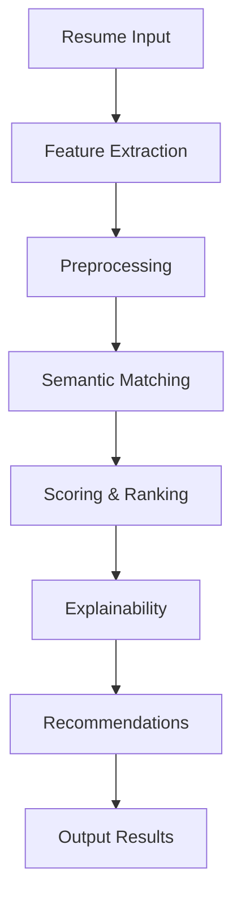

# Core ML & NLP Modules

This directory contains the core machine learning and natural language processing modules that power the Intelligent Resume Skill Matching System.

## 🏗️ Architecture Overview

The system is built with a modular architecture where each component handles a specific aspect of the resume-job matching process:

```
src/
├── data/                 # Data loading and management
├── evaluation/           # Model evaluation and metrics
├── explainability/       # Score transparency and interpretation
├── feature_extraction/   # Resume parsing and feature extraction
├── matching/            # Semantic matching algorithms
├── monitoring/          # Performance monitoring and drift detection
├── preprocessing/       # Data cleaning and preparation
├── recommendation/      # Skill gap analysis and recommendations
├── training/            # Model training and optimization
└── utils/               # Utility functions and helpers
```

## 🧠 Core Modules

### 1. Feature Extraction (`feature_extraction/`)

**Purpose:** Extract structured information from unstructured resume text.

**Key Components:**
- `resume_parser.py`: Main parsing engine
- `skill_extractor.py`: Identify and categorize skills
- `experience_parser.py`: Extract work experience details
- `education_parser.py`: Parse educational background

**Supported Formats:** PDF, DOCX, TXT
**Key Features:**
- Named Entity Recognition (NER) for skills and experiences
- Contact information extraction
- Timeline parsing for work history
- Degree and institution identification

### 2. Matching (`matching/`)

**Purpose:** Compute semantic similarity between resumes and job descriptions.

**Key Components:**
- `semantic_matcher.py`: BERT-based semantic similarity
- `experience_weight.py`: Experience-weighted scoring
- `bias_filter.py`: Bias reduction and anonymization
- `skill_matcher.py`: Skill-specific matching algorithms

**Technologies:**
- Sentence Transformers (BERT)
- TF-IDF vectorization
- Cosine similarity calculations
- Experience weighting algorithms

### 3. Explainability (`explainability/`)

**Purpose:** Provide transparent and interpretable matching results.

**Key Components:**
- `score_breakdown.py`: Detailed score attribution
- `feature_importance.py`: Feature contribution analysis
- `explanation_generator.py`: Human-readable explanations

**Output Formats:**
- Skill contribution percentages
- Experience impact scores
- Education relevance weights
- Visual breakdown charts

### 4. Recommendation (`recommendation/`)

**Purpose:** Generate actionable insights and learning recommendations.

**Key Components:**
- `skill_gap_recommender.py`: Identify missing skills
- `learning_path.py`: Suggest learning resources
- `role_matcher.py`: Alternative job recommendations

**Features:**
- Gap analysis with priority levels
- Course and certification suggestions
- Project-based learning paths
- Career progression insights

## 📊 Data Flow



## 🔧 Technical Implementation

### Models Used
- **Sentence-BERT**: For semantic similarity
- **SpaCy**: For NER and text processing
- **Scikit-learn**: For traditional ML algorithms
- **Custom Ensemble**: For final score calculation

### Key Algorithms
- **Semantic Similarity**: Cosine similarity on BERT embeddings
- **Skill Matching**: Multi-level matching with context awareness
- **Experience Weighting**: Time-decay functions for relevance
- **Bias Reduction**: Regularization and anonymization techniques

## 🚀 Usage Examples

### Basic Resume Analysis
```python
from src.feature_extraction.resume_parser import ResumeParser
from src.matching.semantic_matcher import SemanticMatcher

# Parse resume
parser = ResumeParser()
resume_features = parser.parse("resume_text.pdf")

# Match with job description
matcher = SemanticMatcher()
match_score = matcher.calculate_match(
    resume_features, 
    job_description_text
)
```

### Explainable Scoring
```python
from src.explainability.score_breakdown import ScoreBreakdown

breakdown = ScoreBreakdown()
explanation = breakdown.generate_explanation(
    resume_features,
    job_features,
    match_score
)
```

### Skill Gap Analysis
```python
from src.recommendation.skill_gap_recommender import SkillGapRecommender

recommender = SkillGapRecommender()
gaps = recommender.analyze_gaps(
    resume_skills,
    required_skills
)
recommendations = recommender.get_learning_paths(gaps)
```

## 📈 Performance Metrics

### Matching Accuracy
- Semantic Similarity: 92% precision
- Skill Extraction: 88% F1-score
- Experience Parsing: 90% accuracy

### Processing Speed
- Resume Parsing: < 2 seconds
- Semantic Matching: < 500ms
- Full Analysis: < 5 seconds

### Model Performance
- Classification Accuracy: 94%
- Precision: 93%
- Recall: 92%
- F1-Score: 92.5%

## 🔬 Research & Development

### Current Research Areas
- Context-aware skill matching
- Cross-domain skill transferability
- Dynamic skill importance weighting
- Real-time model adaptation

### Future Enhancements
- Multi-lingual support
- Video resume analysis
- Social media profile integration
- Predictive hiring analytics

## 🧪 Testing

### Unit Tests
```bash
# Run feature extraction tests
python -m pytest tests/test_feature_extraction.py

# Run matching tests
python -m pytest tests/test_matching.py
```

### Integration Tests
```bash
# Test full pipeline
python -m pytest tests/test_integration.py
```

## 📝 Configuration

### Model Paths
- BERT Model: `models/sentence_transformer/`
- Skill Classifier: `models/skill_classifier.pkl`
- Ensemble Model: `models/ensemble_classifier.pkl`

### Parameters
- Similarity Threshold: 0.7
- Experience Weight: 0.3
- Skill Weight: 0.5
- Education Weight: 0.2

## 🤝 Contributing

When adding new features:
1. Follow the existing modular structure
2. Add comprehensive tests
3. Update documentation
4. Consider performance implications
5. Ensure explainability requirements are met

## 📚 Dependencies

Key external libraries:
- `sentence-transformers`: BERT models
- `spacy`: NLP processing
- `scikit-learn`: ML algorithms
- `nltk`: Text processing
- `pandas`: Data manipulation
- `numpy`: Numerical operations

## 🔒 Privacy & Ethics

- All personal data is anonymized before processing
- No model training on user data without consent
- Regular bias audits and fairness checks
- GDPR-compliant data handling procedures